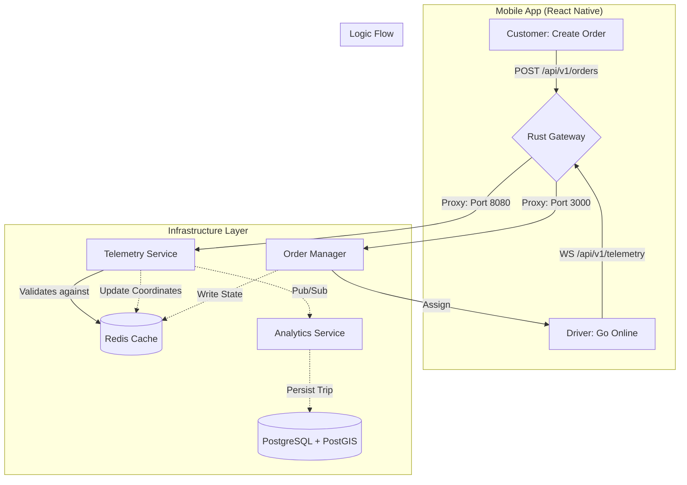

### Roadmap

## 🛠️ Feature Roadmap & Build Order

To stay organized, we should follow this sequence to ensure the "pipes" are connected before we add complex features:

1. Core Connectivity (COMPLETED ✅)

- Set up Rust Gateway as the central entry point.
- Build Order Manager (TS) for basic REST routes.
- Build Telemetry Service (Rust) for WebSocket handshakes.
- Initialize Driver App (Expo) with the dual-mode useTelemetry hook.

2. Persistence & Real-time State (CURRENT STEP 🚧)

- Redis Integration: The Telemetry service should store the "Last Known Location" in Redis so the system knows where every driver is at any second.

- Shared State: The Order Manager needs to check Redis to see if a driver is available.

3. The "Historian" (Next Up)

- Analytics Service (Rust): Create a service that listens to the Redis stream and writes data to PostgreSQL.

- PostGIS: Implement spatial queries (e.g., "Find all drivers within 5km of this pickup").

4. The Customer Experience

- Customer App: A second React Native app (or a different role in the same app) to view the live movement of the assigned driver.

- Map Integration: Using react-native-maps to render the coordinates being spat out by the Rust backend.
